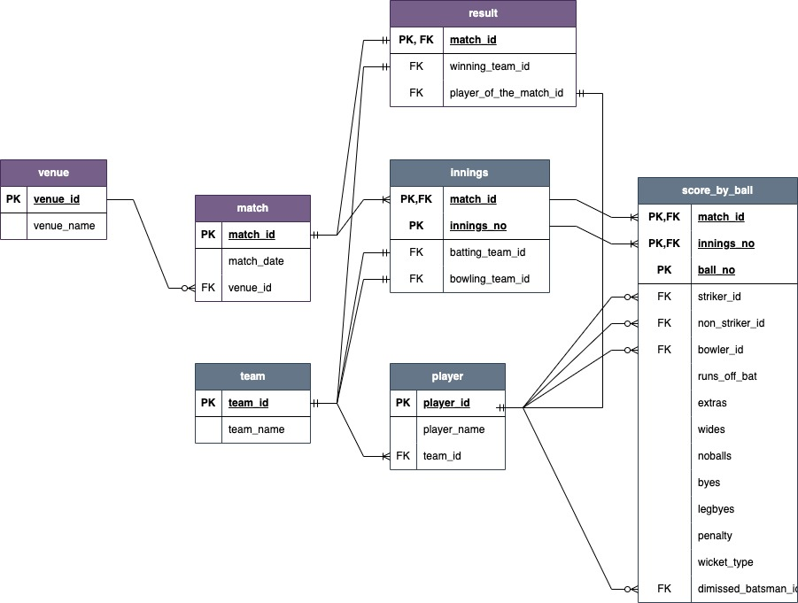

# Indian Premier League 2024 (IPL) TATA IPL
###  IPL is a men's Twenty20 cricket league held annually in India. Founded by the BCCI in 2007, the league features ten state or city-based franchise teams. With its fast-paced matches, diverse player base, and massive fan following, the IPL generates a huge amount of data every season. 

### Creating a database with SQL for data analysis, historical data comparison, and seamless integration with other tools. With the continuous growth of the IPL and the increasing importance of data in sports, leveraging SQL databases is a powerful way to harness the full potential of IPL data, driving better decisions, enhancing fan experience, and ultimately contributing to the success of the league.

## TASK
### Creating a normalized database with relationship and integrity constraints - Database Name "IPL"

# Tables
- Venue Table
- Team Table
- Player Table
- Match Table
- Innings Table
- Score_by_ball Table
- Result Table

## Match level information
1. Match Number
2. Venue
3. Match Date
4. Winning Team Name

## Innings level information
1. Name of the teams played
2. Total runs scored
3. Total wickets lost
4. Total overs played

## Batting Summary (Batsman Level) Information 
1. Team Name
2. Batsman Name
3. Runs
4. Balls
5. 4s
6. 6s
7. Strike Rate

## Batting Summary (Extras) Information Required
1. Team Name
2. extras
3. noballs
4. wides
5. byes
6. legbyes
7. penalities
   

## Bowling Summary (Bowler Level) Information Required
1. Batting Team Name
2. Bowler Name
3. Overs
4. Runs
5. Wickets
6. Economy
7. Dots# IPL2024-SQL
